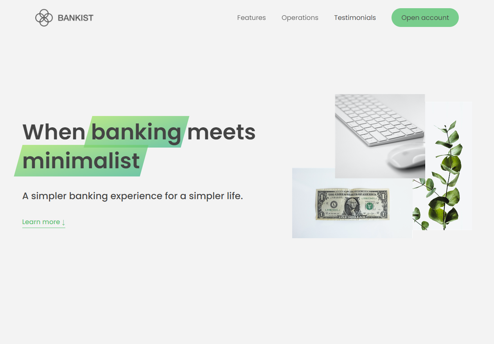

# banksit-website

A simple website with some interested features created with HTML , CSS and JavaScript for learning purposes and to practice on (Advanced DOM and Events) with JavaScript

## Features implemented in the website

- modal windows
- smooth scrolling
- fadeout animation on the NAV links
- sticky navigation bar
- tabs component
- image slider
- relieve sections on scroll animation
- laze load images

### DEMO

### [LIVE DEMO](https://abdelrhman-ahmed-kamal.github.io/bankist-website/)
